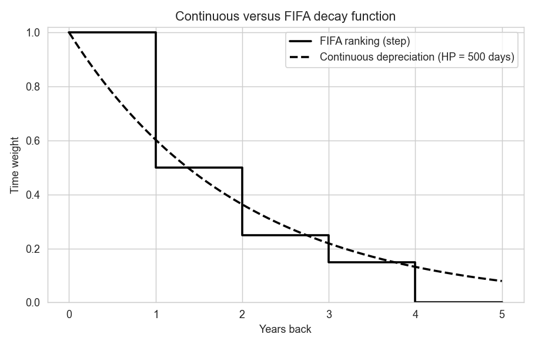
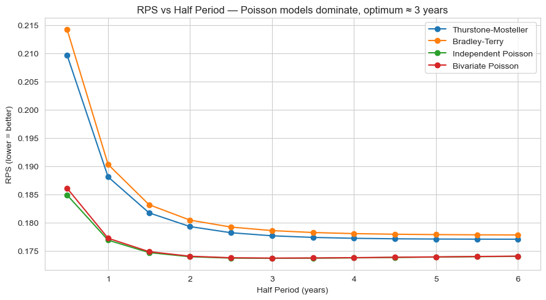
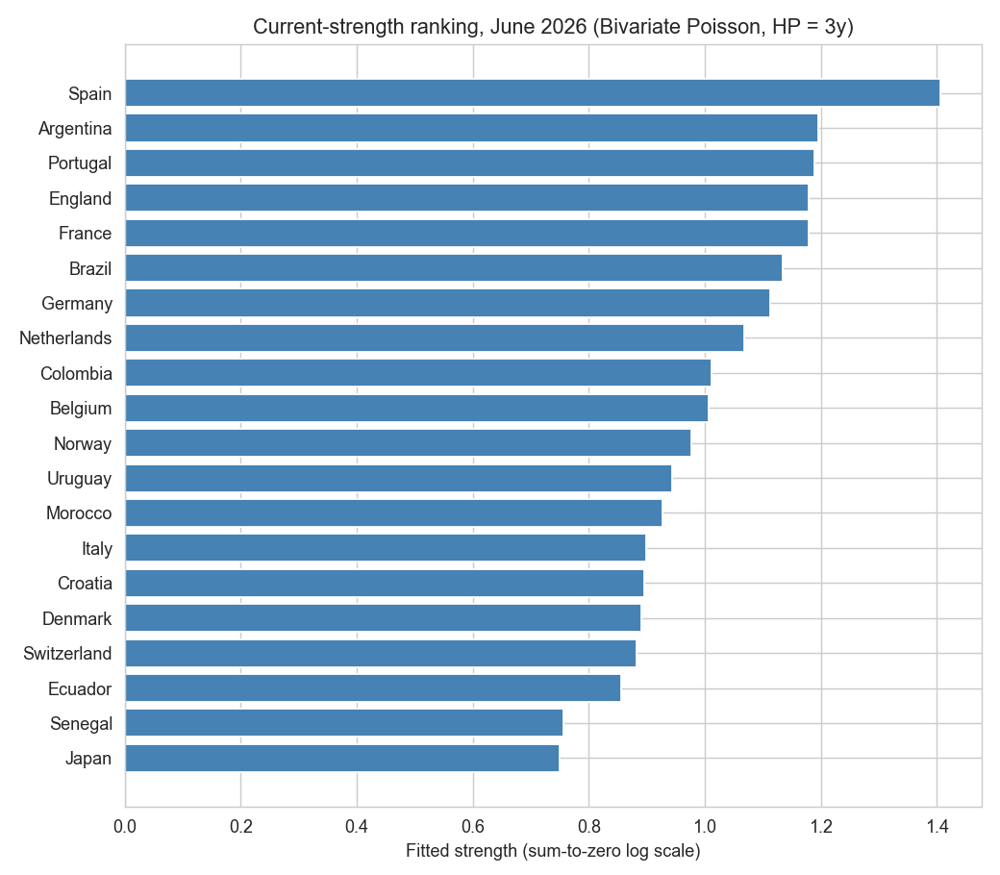
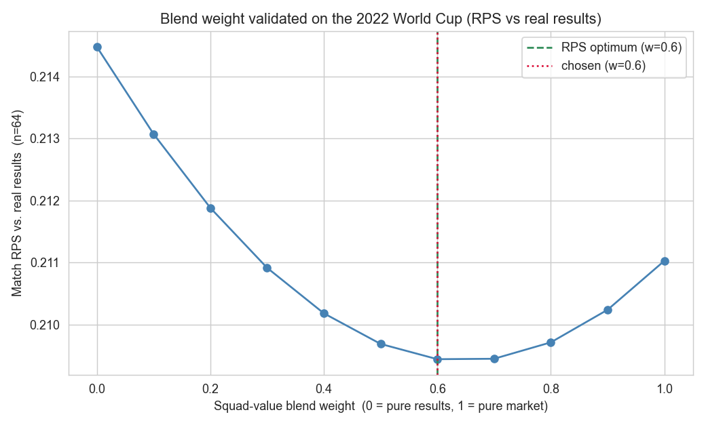
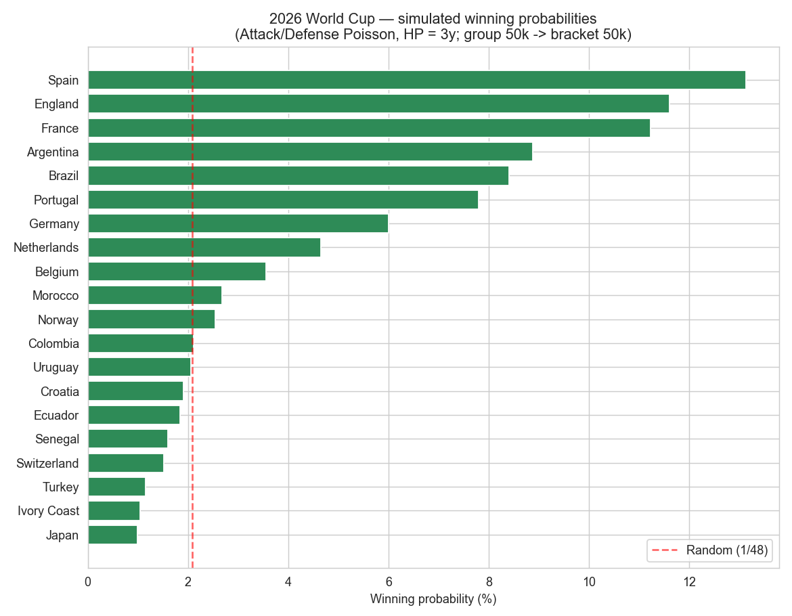
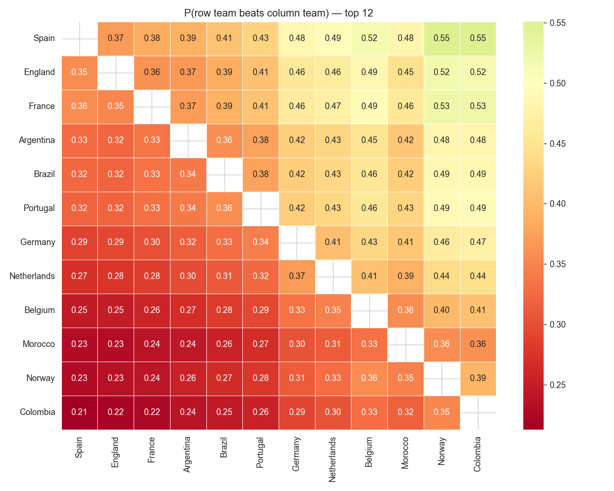
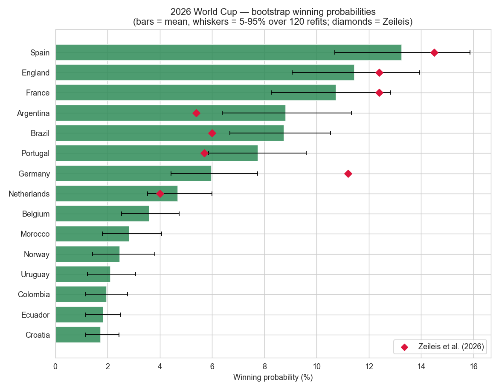
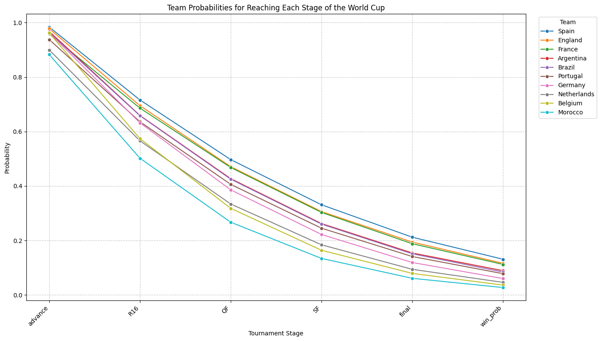

# Time Series Forecasting — FIFA World Cup 2026

Reproduction and extension of **Ley, Van de Wiele & Van Eetvelde (2018)**, *"Ranking soccer teams on basis of their current strength: a comparison of maximum likelihood approaches"* ([arXiv:1705.09575](https://arxiv.org/abs/1705.09575)), extended into a Monte-Carlo forecast of the 2026 World Cup.

Course project — *Time Series Analysis & Forecasting*, Reichman University, 2026 (Presentation #2).

## Idea

Team strength is non-stationary. The paper handles this like **exponential smoothing**: every match is down-weighted by a smooth half-life decay

`w = (1/2)^(days_ago / HalfPeriod)`

multiplied by a match-importance weight (friendly 1, qualifier 2.5, continental tournament 3, World Cup 4), and strengths are estimated by weighted maximum likelihood. This replaces FIFA's old step-function decay.

| Paper mechanism | Course topic |
|---|---|
| Half-life time-depreciation weighting | Exponential smoothing |
| Poisson regression for goals | Regression models |
| Match-importance weights | Regression with external information |
| Win/Draw/Loss probabilities | Forecasting ordinal outcomes |
| RPS-based model selection | Forecast evaluation |
| Monte-Carlo tournament simulation | Forecasting via simulation |

## What the notebook does

`FIFA2026_Ranking_and_Forecast.ipynb` (runs in Google Colab, no Kaggle account needed — data is fetched from [martj42/international_results](https://github.com/martj42/international_results), ~49,400 matches, 1872–2026):

1. **Reproduction** — one generic weighted-MLE fitter (L-BFGS-B, analytic gradients) with four models: Thurstone–Mosteller, Bradley–Terry, Independent Poisson, Bivariate Poisson. Rolling backtest on competitive matches 2012–2017 (train on the preceding 8 years), sweeping the Half Period, scored by Rank Probability Score (RPS).
2. **Current-strength ranking** — Bivariate Poisson, Half Period 3y. Refit at 16 Oct 2017 it recovers the paper's Table 3 (top-20 overlap 20/20).
3. **Extension: 2026 forecast** — attack/defense Poisson model fit strictly on matches before the 11 June 2026 kickoff (leakage guard), blended with Transfermarkt squad market values, then a two-phase simulation (groups ×50,000, knockout bracket ×50,000) with a bootstrap uncertainty range.

## Results

**Reproduction (Table 2)**

| Model | Optimal Half Period | RPS |
|---|---|---|
| Independent Poisson | 3 y | 0.1737 |
| Bivariate Poisson | 3 y | 0.1737 |
| Thurstone–Mosteller | 6 y | 0.1771 |
| Bradley–Terry | 6 y | 0.1778 |

Poisson models win, Bivariate ≈ Independent (fitted covariance ≈ 0), optimal Half Period ≈ 3 years — matching the paper. Absolute RPS (~0.174 vs. the paper's 0.165) is higher due to data vintage, team-coverage filter and annual rather than per-round refits.

**Market-value blend** — validated on the 2022 World Cup: results only (w=0) RPS 0.2145, blend (w≈0.6) 0.2094, market only (w=1) 0.2110.

**2026 win probabilities vs. Zeileis et al. (2026)**

| Team | Ours | Zeileis et al. |
|---|---|---|
| Spain | 13.1% | 14.5% |
| England | 11.6% | 12.4% |
| France | 11.2% | 12.4% |
| Germany | 6.0% | 11.2% |
| Brazil | 8.4% | 6.0% |
| Argentina | 8.9% | 5.4% |

## Charts

All charts are generated by the notebook (`figures/`).

**1. Smooth half-life decay vs. FIFA's step function**



**2. RPS vs. Half Period — Poisson models dominate, optimum ≈ 3 years**



**3. Current-strength ranking, June 2026 (Bivariate Poisson, HP = 3y)**



**4. Market-value blend weight validated on the 2022 World Cup**



**5. 2026 World Cup win probabilities (50,000 simulations)**



**6. Match-level expected-goals heatmap**



**7. Win probabilities with bootstrap 5–95% ranges**



**8. Probability of reaching each stage**




## Limitations

Goal independence is only partly relaxed; the model cannot anticipate injuries or coaching changes; market value is an imperfect talent measure. Next steps: Dixon–Coles low-score correction, dynamic/state-space Poisson (Koopman–Lit 2015), richer external regressors (Elo, bookmaker odds; Groll et al. 2019).

## Run

```bash
pip install numpy pandas scipy matplotlib seaborn jupyter
jupyter notebook FIFA2026_Ranking_and_Forecast.ipynb
```

## References

- Ley, Van de Wiele, Van Eetvelde (2018), arXiv:1705.09575
- Zeileis et al. (2026), World Cup 2026 forecast
- Groll et al. (2019), *JQAS*
- Epstein (1969), RPS

*Notebook prepared with AI assistance (Claude, Anthropic), declared per course policy.*
